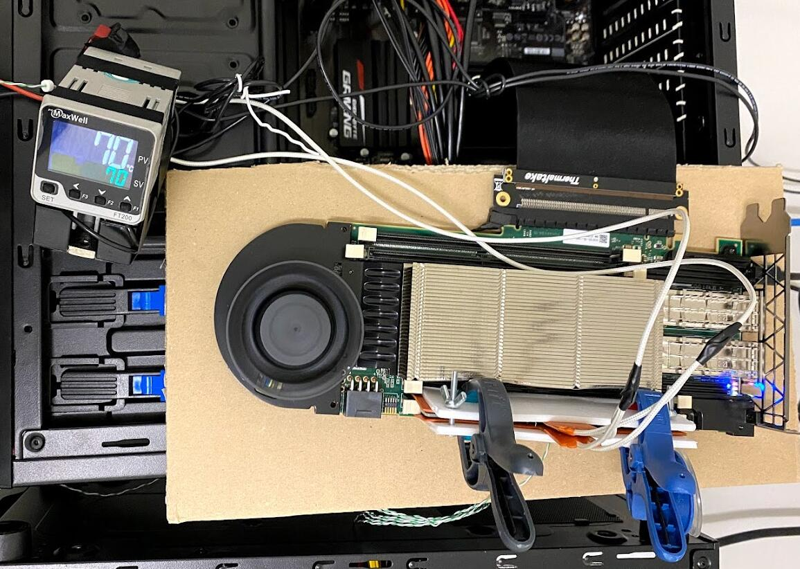

# DRAM Bender

DRAM Bender is an experimental FPGA-based memory controller design that can be used to develop tests for DDR4 [SO/R/U]DIMMs. DRAM Bender currently supports the *Bittware XUSP3S, XUPP3R, XUPVVH and Xilinx Alveo U200* boards. 

<p align="center">
<br>
	<em>An example DRAM Bender prototype.</em>
</p>
	


DRAM Bender is the next version of the [SoftMC memory testing infrastructure](https://github.com/CMU-SAFARI/SoftMC). DRAM Bender introduces general purpose registers and a brand new DRAM Bender ISA to provide a programmable memory controller.

We provide a) prebuilt binaries for quick installation and b) the source code (both in Verilog and C++) that you can modify as you wish.

## Cite DRAM Bender

Please cite the following paper if you find DRAM Bender useful:

[A. Olgun, H. Hassan, A. G. Yaglikci, Y. C. Tugrul, L. Orosa, H. Luo, M. Patel, O. Ergin, O. Mutlu, "DRAM Bender: An Extensible and Versatile FPGA-based Infrastructure to Easily Test State-of-the-art DRAM Chips", IEEE TCAD, June 2023.](https://ieeexplore.ieee.org/document/10141996)

Link to the PDF: https://arxiv.org/pdf/2211.05838.pdf  

Below is bibtex format for citation.
```
@article{olgun2023drambender,
      title={{DRAM Bender: An Extensible and Versatile FPGA-based Infrastructure to Easily Test State-of-the-art DRAM Chips}}, 
      author={Olgun, Ataberk and Hassan, Hasan and Yaglikci, A. Giray and Tugrul, Yahya Can and Orosa, Lois and Luo, Haocong and Patel, Minesh and Ergin, Oguz and Mutlu, Onur},
      year={2023},
      journal={IEEE TCAD}
}
```

## More DRAM Bender Resources

[DRAM Bender Tutorial Video](https://www.youtube.com/watch?v=FklVEsfdZCI): 43-minute tutorial on how to set up and use DRAM Bender.

[ETH Projects & Seminars Course on DRAM Bender](https://safari.ethz.ch/projects_and_seminars/spring2023/doku.php?id=softmc)

## Prior Works that Use DRAM Bender

We provide the sources to reproduce the results of two prior work: U-TRR ([PDF](https://people.inf.ethz.ch/omutlu/pub/U-TRR-uncovering-RowHammer-protection-mechanisms_micro21.pdf)) and QUAC-TRNG ([PDF](https://people.inf.ethz.ch/omutlu/pub/QUAC-TRNG-DRAM_isca21.pdf)).

U-TRR's sources are published as a separate repository and can be found [at this link](https://github.com/CMU-SAFARI/U-TRR).

QUAC-TRNG's sources are published both as a separate repository [at this link](https://github.com/CMU-SAFARI/QUAC-TRNG), and under `sources/apps/QUAC-TRNG` directory inside this repository.

We plan to open source the following prior research works that used DRAM Bender as part of future work:

- RowPress: Amplifying Read-Disturbance in Modern DRAM Chips, to appear in ISCA 2023
- SpyHammer: Using RowHammer to Remotely Spy on Temperature, [link to arXiv](https://arxiv.org/abs/2210.04084)
- HiRA: Hidden Row Activation for Reducing Refresh Latency of Off-the-Shelf DRAM Chips, [link to arXiv](https://arxiv.org/abs/2209.10198)
- Revisiting RowHammer: An Experimental Analysis of Modern DRAM Devices and Mitigation Techniques, [link to arXiv](https://arxiv.org/abs/2005.13121)
- A Deeper Look into RowHammer's Sensitivities: Experimental Analysis of Real DRAM Chips and Implications on Future Attacks and Defenses, [link to arXiv](https://arxiv.org/abs/2110.10291)
- Understanding RowHammer Under Reduced Wordline Voltage: An Experimental Study Using Real DRAM Devices, [link to arXiv](https://arxiv.org/abs/2206.09999)
- TRRespass: Exploiting the Many Sides of Target Row Refresh, [link to arXiv](https://arxiv.org/abs/2004.01807), proof of concept already available [on Github](https://github.com/vusec/trrespass)
- EDEN: Enabling Energy-Efficient, High-Performance Deep Neural Network Inference Using Approximate DRAM, [link to arXiv](https://arxiv.org/abs/1910.05340)

## Repository File Structure

```
.
+-- images
+-- prebuilt/                       # Prebuilt bitstreams
|   +-- .../           
+-- projects/                       # Vivado projects
|       +-- U200/                   
|       +-- VU095/                  # Vivado project for the XUSP3S board
|       +-- XUPVVH/
|       +-- XUSP3R/                 # Vivado project for the XUPP3R board
+-- sources/                       
        +-- api/                    # DRAM Bender software API code
        +-- apps/                   # Example DRAM Bender applications
        +-- hdl/                    # DRAM Bender's Verilog sources
        +-- xdma_driver/            # Xilinx PCIe driver sources
	+-- scripts/		    # Helper scripts for installation
+-- README.md                       # This file
```
## Installation Guide:

### Prerequisites:
- A Linux Host Machine, (We tested on Ubuntu 16.04, 18.04, 20.04)
- DRAM Bender uses an 8-lane PCIe interface to communicate with the Host Machine. So, you would also need to attach the board to the  8x/16x PCIe slot on the motherboard of the Host Machine
- One of the four FPGA boards: Bittware XUSP3S, XUPP3R, XUPVVH, Xilinx Alveo U200
  - These boards should be connected to the host machine via a programming cable. Please refer to manufacturer data sheets or user guides (e.g., [this document](https://docs.xilinx.com/r/en-US/ug1289-u200-u250-reconfig-accel) for Alveo U200) for more information on how to use the programming cable.
  - Make sure to install the Xilinx Cable Drivers. These drivers are not installed by default in some cases. Follow [this guide](https://docs.xilinx.com/r/2020.2-English/ug973-vivado-release-notes-install-license/Install-Cable-Drivers) to learn how to install cable drivers. 
- A proper form factor memory attached to your FPGA board
- If you want to build your own bitfile from the source:
  - Xilinx Vivado 2018.2 for the XUSP3S and XUPP3R boards
  - Xilinx Vivado 2019.2 for the XUPVVH board
  - Xilinx Vivado 2020.2 for the Alveo U200 board


### Overview of the Prebuilt Bitstreams

We provide a set of bitstreams in the `prebuilt` directory under four directories that contain the bitstreams for a specific FPGA board.

* XCU200: We provide four bitstreams for: (1) dual rank x8 RDIMMs, (2) dual rank x8 UDIMMs, (3) single rank x8 UDIMMs (you can just use the dual rank bitfile), (4) single rank X4 RDIMMs. All of these bitstreams allow DRAM Bender to work with the memory module plugged in on the module slot that is visible in the following picture.

<p align="center">

</p>

* XUSP3S: We provide two bitstreams, each supporting either one of the SODIMM slots for single on the FPGA board. The default bitstream (`XUSP3S.bit`) will enable DRAM Bender to work with the SODIMM plugged in on the slot that is visible in the following picture.

<p align="center">

</p>

* XUPP3R: We provide three bitstreams for: (1) single rank x4 RDIMMs, (2) dual rank x8 RDIMMs, (3) single rank x8 UDIMMs.

<p align="center">

</p>

* XUPVVH: We provide a single bitstream for x4 RDIMMs.

<p align="center">

</p>

We provide a script (```prebuild/programFPGA.sh```) that programs the FPGA according to user-specified board, DIMM slot, DIMM type, the number of ranks and the DQ width. Run the script as ```./programFPGA.sh <board> <slot> <dimm_type> <num_rank> <dq_width>```

### 1) Installing the Xilinx XDMA driver:

Host computer communicates with the board using a PCIe bus. You need to have [Xilinx XDMA](https://www.xilinx.com/support/answers/65444.html) driver installed on your system to enable the communication with the FPGA via the PCIe bus, we provide a modified version of the Xilinx XDMA driver in our repo under sources/xdma-driver. Do not forget to attach your FPGA board to a PCIe slot.

If you encounter build errors during compilation of the XDMA driver it is likely due to a kernel version mismatch. You can try downloading the newest version of the XDMA drivers from [Xilinx's Github repo](https://github.com/Xilinx/dma_ip_drivers/tree/master/XDMA/linux-kernel).

You may refer to the readme file under sources/xdma-driver for detailed information on installing the driver.

Please load the driver with the option enable_credit_mp set to "1": `insmod ../driver/xdma.ko enable_credit_mp=1` (or just run the `load_driver.sh` script). Otherwise DRAM Bender won't be able to send and receive data correctly to the FPGA.

### 2) Creating and Downloading the DRAM Bender bitfile to the FPGA (tailored for XUSP3S):

**a) Quick Installation using Prebuilt Binaries**

You will find all that you need inside "prebuilt" folder.

1. You need to download the bitfile (e.g., `XUSP3S_C1_SODIMM_1R_x8.bit`) into your FPGA using an appropriate tool (we recommend Xilinx Vivado 2018.2 for the XUSP3S board).
    * You can also use the provided shell script `program_FPGA.sh` to program the board with one of the prebuilt bitfiles. You need to define VIVADO_EXEC variable before running the script `export VIVADO_EXEC=/path/to/vivado/executable`.
2. Reboot the computer once you program the FPGA board.
3. Load the Xilinx XDMA driver using the script provided in `sources/xdma-driver` directory `sudo ./load_driver.sh`.

**b) Manual Installation from the Source Code**

Generating the DRAM Bender bitfile from source project is a bit tricky:

* Use Xilinx Vivado 2018.2 to open the project, which is located located at *projects/VU095/VU095.xpr*.
	* This will also include all the required IP into the project.
* Before proceeding with the implementation, you need to generate DDR4 Interface IP's output products. You may do this by using the GUI or by typing the following to the TCL command window: `generate_target all [get_files SoftMC/SoftMC.srcs/sources_1/ip/phy_ddr4.xci]`
* Lock the IP by entering `set_property IS_LOCKED true [get_files phy_ddr4.xci]` after it's output products are generated. Navigate to DRAM Bender project (projects/VU095) directory and run *apply_patches.sh* like so `$ ./apply_patches.sh`. This will modify the IP source files, so that DDR4 CAS commands can be executed from any command slot the IP provides us with.
* You need to delete cached synthesis runs, so that the DDR4 Interface IP can be synthesized again. Do this so by first removing *VU095.cache* under your project directory. Reset synthesis run of the IP by using the TCL console `reset_run [get_runs phy_ddr4_synth_1]`, then re-launch the synthesis run `launch_run [get_runs phy_ddr4_synth_1]`.
* At this point you may proceed with the implementation and bitstream generation using Vivado GUI.
* Then follow the steps in **a)**

*(Where necessary to simulate the DRAM Bender hardware, we provide a sample testbench module ("sim_tb_top.v") that you can start with. To enable simulation, you will need to include additional sources that are provided with DDR4 SDRAM IP's example design. After generating output products right-click the IP in the sources window, select generate example design. Add all files in the folder "imports" under the example design's project directory.)*

**c) Automated Installation from the Source Code**

You can also use the generation script to automate the steps explained in **b)** (verified for the XUSP3S and the U200 board):

* Refer to board-specific installation guides (below) and modify `project.vh` accordingly when required.
* Launch your terminal and change your working directory to project root *projects/VU095/*.
* Run the bitstream generate script: `vivado -mode batch -source ../../sources/scripts/generate.tcl -tclargs <NUM_JOBS>`
	* Generation script is located at *sources/scripts/generate.tcl* by default, however if you wish to change the location update `-source <SCRIPT_PATH>` argument accordingly.
	* `<NUM_JOBS>` argument specifies the number of jobs used by Vivado for design runs. Should not be higher than the number of physical threads on your processor.
* Wait for script to finish synthesis, implementation and bitstream generation.
* Then follow the steps in **a)**

## Installation Guide (XUPP3R):

**a) Quick Installation using Prebuilt Binaries**

There are two bitstreams inside the "prebuilt" folder, one for the one rank x4 RDIMM configuration, one for the two rank x8 RDIMM configuration.

**b) Installation from the Source Code**

You first need to modify the `project.vh` header file according to your DIMMs configuration. You also need to define either `XUPP3R_x4` or `XUPP3R_x8` for the x4 configuration and for the x8 configuration respectively. You can find the required pinout constraints for both configurations in the target constraint file (XUPP3R_base.xdc). You will need to use either one of the existing RDIMM pin assignments (RDIMMx4 for the x4 config. and RDIMMx8 for the x8 config). 

From here on you may refer to the installation guide for XUSP3S.

## Installation Guide (Alveo U200):

**a) Quick Installation using Prebuilt Binaries**

There are four bitstreams in the prebuilt directory for: (1) dual rank x8 RDIMMs, (2) dual rank x8 UDIMMs, (3) single rank x8 UDIMMs (you can just use the dual rank bitfile), (4) single rank X4 RDIMMs.

**b) Installation from the Source Code**

You first need to modify the `project.vh` header file according to your DIMMs configuration. Then, you need to select the correct constraints to map physical DDR4 interface signals to PHY IP inputs/outputs.

From here on you may refer to the installation guide for XUSP3S.

### Testing SODIMMs with the Alveo U200 board (this subsection is work in progress)

We recommend users who would like to test DDR4 SODIMMs obtain a SODIMM to DIMM adapter and use it on the widely available Alveo U200 board. We have tested the [JET-5608AA](https://www.eztest.com.tw/service_2_detail/46.htm) DDR4 SODIMM to DIMM adapter for this purpose. We suggest you contact the manufacturer directly to purchase the adapter. The Alveo U200 DRAM Bender prototype can test all major DDR4 module form factors/types (UDIMMs, RDIMMs, and SODIMMs) with a SODIMM to DIMM adapter.

<p align="center">
<br>
	<em>An Alveo U200 board using the SODIMM to DIMM adapter.</em>
</p>

## Simulating a DRAM Bender Design

This section describes how to run a Vivado simulation of the DRAM Bender hardware. 

1. Open the U200 project (located in `projects/U200/U200.xpr`) using Vivado 2020.2.
2. Right-click on the phy_ddr4_udimm IP on the hierarchy window and select 'Open IP Example Design'.
3. Click 'OK'. This will generate the necessary simulation models for the IPs and a DRAM module such that we can run a full DRAM Bender simulation (i.e., as if it was deployed on the FPGA).
4. Include the generated simulation files in our project.  
4.1. In our 'U200.xpr' project, click 'Add Sources' on the Project Manager window.  
4.2. Select 'Add or create simulation sources'.  
4.3. Click 'Add files'.  
4.4. Navigate to the example project's directory, and then into the 'imports' directory.  
4.5. Select all files and click OK.  
4.6. Click Finish.
4.7. If `timing_tasks.sv` causes a syntax error, right-click on it on the hierarchy window and click on 'Set File Type'.  
4.8. Select 'Verilog Header' as the file type and click OK.  
5. Set `sim_tb_top` as the top module for simulation.
6. Launch simulation by clicking 'Run Simulation' on the Project Manager window.


### What is simulated?

By default, the simulation 1) quickly 'calibrates' the simulated DRAM models, and 2) runs the DRAM Bender program embedded in the `instr_blk_mem_sim` block memory IP.

You can modify the simulated DRAM Bender program with any DRAM Bender program. To do so, use the `save_coe_here()` function to create the `program.coe` file that contains your program. Then you embed this program in the `instr_blk_mem_sim` IP:

1. Double-click on the IP on the hierarchy window to re-customize it.
2. Navigate to 'Other Options'
3. Next to Coe File, click 'Browse', find and select your `program.coe` file.
4. Click OK, generate the output products to make sure the change is reflected in the simulated `inst_blk_mem_sim` IP.

When you run the simulation after completing the above steps, DRAM Bender will execute your program.

## Working with Example Tests

### Installing Boost

This branch of the repo requires some headers in boost lib to be present. You may download and build boost-lib from [here](https://www.boost.org/users/history/version_1_65_0.html) or if you are using ubuntu you can install it using `apt install libboost-all-dev`. 

Example tests under source/apps assume headers in boost lib to be present under project directory. Assuming you have DRAM Bender setup in `/home/yourname/DRAMBender`, headers from boost library should be under `/home/yourname/DRAMBender/boost-lib`. You can also modify Makefiles under source/apps/ if you want to install boost library somewhere else.

If you have installed ubuntu using `apt install libboost-all-dev`, you only need to make sure that you are linking with libboost `-lboost`.

### Smalltest Quickstart

`Smalltest` is a DRAM Bender application (located under `sources/apps/Smalltest`) that can be used as a sanity-check tool to see whether DRAM Bender and/or the DRAM module under test is working properly. It traverses all banks in the DRAM row by row, writing to and then reading from all cache lines in the row. This test takes ~8 seconds to execute on a DRAM module with 16 banks and 32768 rows per bank.

* First compile the test using `make`
* You may now run the generated binary `sudo ./SoftMC_rdwr` to perform a test on DRAM

As `Smalltest` is testing through all banks in the DRAM, it will print the progress that which banks have been tested as well as any errors it encounters while reading data back from the DRAM. There should not be any error if both DRAM Bender and the DRAM module are working properly. If there is a large amount of errors, it indicates that:
* Residual states from a previous DRAM Bender application are not cleared. To solve this, run `sudo sources/apps/ResetBoard/full_reset.sh`.
* The DRAM module is not connected properly to the FPGA platform.
If `Smalltest` does not print any progress, then it is very likely that the platform is programmed with a bitfile not compatible with the currently installed DRAM module.

### Elaborating on Smalltest

A DRAM Bender test first needs to initialize the DRAM Bender platform. This will open file descriptors required to communicate with the FPGA over PCIe, and initialize various structures in DRAM Bender.
```
Program program;
SoftMCPlatform platform;
int err;

if((err = platform.init()) != SOFTMC_SUCCESS){
    cerr << "Could not initialize SoftMC Platform: " << err << endl;
}
```
Usually you would want to reset the unwanted state in DRAM Bender by telling the platform to reset DRAM Bender logic.
```
platform.reset_fpga();
```
You can generate DRAM Bender programs sequentially by adding instructions and labels where needed.
```
  program.add_inst(SMC_LI(NUM_ROWS, 8));   // Load #rows to reg8
  program.add_inst(SMC_LI(NUM_BANKS, 11)); // Load #banks to reg11

  program.add_inst(SMC_LI(8, 0)); // Set column address stride register to 8
  program.add_inst(SMC_LI(1, 1)); // Set BASR to 1
  program.add_inst(SMC_LI(1, 2)); // Set RASR to 1

  program.add_inst(SMC_LI(0xf0f0f0f0, 7)); // Data we are filling DRAM with
  for(int i = 0 ; i < 16 ; i++) // Pattern is loaded into the wide register in 16 loads
    program.add_inst(SMC_LDWD(7,i));

  program.add_inst(SMC_LI(0, 7)); // Load bank address register with 0
  program.add_label("BANK_BEGIN"); // Add a label
```
Later you can specify branch targets using these labels by adding branches with a special function call. Currently supported branch types are `BR_TYPE::BL` and `BR_TYPE::BEQ`, you can also insert an unconditional branch `BR_TYPE::JUMP`. One thing to note about branches is that they take 6 fabric cycles (36 ns @666 MHz) to execute. 
```
  program.add_inst(SMC_ADDI(6,1,6));
  program.add_branch(program.BR_TYPE::BL,6,8, "ROW_BEGIN"); // if reg6<reg8 jump to "ROW_BEGIN"
  program.add_inst(SMC_ADDI(7,1,7));
  program.add_branch(program.BR_TYPE::BL,7,11,"BANK_BEGIN");
```
DRAM Bender is designed such that an instruction either indicates a 64-bit conventional instruction that operates on registers, or four 16-bit DDR commands that are issued to the DRAM connected to the board. Currently we provide a function `__pack_mininsts(DDR_CMD,DDR_CMD,DDR_CMD,DDR_CMD)` that can be used to pack-up four DDR commands into a DRAM Bender instruction. Below is from the example code which is used to send PRE and ACT commands to DRAM.
```
  // PRE & wait for tRP
  program.add_inst(__pack_mininsts(
    SMC_PRE(7, 0, 0),                 
    SMC_NOP(), SMC_NOP(), SMC_NOP()
  ));
  program.add_inst(all_nops());
  program.add_inst(all_nops());

  // ACT & wait for tRCD
  program.add_inst(__pack_mininsts(
    SMC_ACT(7, 0, 6, 0),
    SMC_NOP(), SMC_NOP(), SMC_NOP()
  ));
  program.add_inst(all_nops());
  program.add_inst(all_nops());
```
Don't forget to include `program.add_inst(SMC_END());` at the end of your program, this tells DRAM Bender that the program has ended.

Once you've formed the program sequentially, you can offload it to the FPGA by calling `platform.execute(program)`. The platform object will then do some pre-processing on the instruction stream and send it to the FPGA board.

If you've issued any READs to DRAM, DRAM Bender logic will send them to the host machine over the PCIe bus. You can receive this data in your program using `platform.receiveData(void * buffer, int read_size_in_bytes)`. Here is an example from Smalltest.
```
  while(1)
  {
    rc++;
    if(rc % (BANK_SIZE/READ_SIZE) == 0)
      printf("Bank %d finished!\n", rc / (BANK_SIZE/READ_SIZE));
    if(rc == DIMM_SIZE/READ_SIZE)
      break;
    platform.receiveData(buf,READ_SIZE);
    for(int j = 0 ; j < READ_SIZE ; j++){
      if(pattern != (uint8_t)buf[j]){
        printf("Pattern mismatch!\n");
      }
    }
  }
```

### [Experimental] Python API
DRAM Bender provides a ```python``` interface through ```pybind11``` (implemented in ```sources/api/pySoftMC/pySoftMC.cpp```). The user can interact with DRAM Bender through ```python``` scripts in almost the same way as the native ```C++``` API. To build DRAM Bender as a ```python``` library, clone the repo with the ```--recursive``` option and then run ```cd sources/api/pySoftMC; make```.

An example script that performs a double-sided RowHammer attack is provided in ```sources/api/pySoftMC/example.py```


### [Experimental] DRAM Bender Parser

DRAM Bender also has a parser that can be used to generate programs written in [smcLang](https://docs.google.com/document/d/1NCLOJYVIyyjFrWdFW1Jc3vrwUWC6UgNyl025i2SQtLA/edit?usp=sharing). A working example is included in the Smalltest directory.

To be able to parse programs, DRAM Bender needs a parser executable in the working directory. DRAM Bender uses lex&yacc to parse smcLang programs. Compiling the smcLang parser is done using the following makefile rule under Smalltest directory. You may copy this rule to your makefile and simply run `make parse` in your test directory to obtain a copy of the parse in the working directory.

```
parser:
	$(MAKE) -C ../../api/lexyacc
	cp ../../api/lexyacc/smc_parser .
```

Simply calling `Program program("your_smcLang_source.smc")` constructs a program from a given smcLang source file.

It is important that the program constructor, `Program program("read_write.smc")` in the example, should be called before initializing the platform `platform.init()`. The constructor will run another executable to parse your smcLang program, somehow this interferes with XDMA file descriptors and will render the platform unusable when called after initializing the platform.
```
// Demo using the smc file as program input
if(USE_SMC_FILE)
{
  // Load demo smc program from file using
  // program's constructor
  Program program("read_write.smc");
  wr_pattern = 0x1a2b3c4d;
  printf("Program Ready\n");

  // Initialize the platform, opens file descriptors for the board PCI-E interface.
  if((err = platform.init()) != SOFTMC_SUCCESS){
      cerr << "Could not initialize SoftMC Platform: " << err << endl;
  }
  // reset the board to hopefully restore the board's state
  platform.reset_fpga();
  // Transfer the program to the FPGA board
  platform.execute(program);
  printf("Sent instructions\n");
}
```

### Debugging DRAM Bender Hardware

You can simulate and debug a DRAM Bender program as if it is running on the FPGA, without using an FPGA. For using debug feature, you need to follow some steps;
- First, you need to generate required simulation files. You may do this by running a behavioral simulation with the GUI or modify debug function as `program.debug(PROJECT_DIRECTORY, true);` for the first time which will launches a simulation and closes immediately before the actual debugging operation.
- You should provide your VU095 project directory to your program like `#define PROJECT_DIRECTORY "/home/.../SoftMC_v2/projects/VU095"`.
- After, you can write your DRAM Bender program with the DRAM Bender API. After writing the program, you need to upload your program to instruction memory with `program.save_coe(PROJECT_DIRECTORY);`.
- After, you can start debugging your program with `program.debug(PROJECT_DIRECTORY, false);`.

When the debugger is started, you can enter commands to the terminal and get the results such as register and memory values. The commands are listed below,

-`run #x`: Runs the simulation for #x time. Ex. `run 100ns`

-`step`: Runs the simulation for 1 DRAM Bender cycle(6ns). Ex. `step`

-`time`: Gets the current time of simulation. Ex. `time`

-`reg #x`: Gets the selected register value. Ex. `reg 5`

-`mem #x`: Gets the data of selected memory. Ex. `mem 100`

-`until #x`: Runs the simulation until the #xth instruction. Ex. `until 56`

-`btwn #x #y`: Gets the number of cycles between #xth and #yth instructions. Ex. `btwn 2 10`

-`stat`: Gets the numbers of DDR operations (WRT, RD, PRE, ACT, REF). Ex. `stat`

-`exit`: Exits the simulation and the debugger. Ex. `exit`

#### Debug with DRAM Timing Parameter Update

You can use your timing parameters for the DRAM module. To enable timing update operation, firstly, you need to edit `/SoftMC_v2/projects/phy_ddr4_ex/imports/ddr4_sdram_model_wrapper.sv` as followed and resynthesize the project.
```
`define DDR4_938_Timing -> `define DDR4_1500_Timing
`define FIXED_2133      -> `define FIXED_1333
```
After, you should provide the parameters and the values that you want to change as a text file with the following format, and you should provide the text file to DRAM Bender program.
```
tRTP    = 7500
tWTRc_S = 2
```
After providing required parameters, you can update parameters with `program.debug(PROJECT_DIRECTORY, PARAMETER_FILE);`. Note that, update operation will overwrite instruction memory files; thus, it is recommended that call `program.save_coe(PROJECT_DIRECTORY);` function after update operation.

Also, there is example program for debugging located under `/sources/apps/DebugExample`.

### Frequently Encountered Errors

> I just rebooted the machine connected to the FPGA board, now I cannot readback any data.

XDMA driver must be loaded with the following option every time the machine restarts `enable_credit_mp=1`. This can be done by navigating into sources/xdma_driver/ and running `sudo ./load_driver.sh`. You may refer to the [installation guide](#installation-guide-(XUSP3S)) for detailed instructions.

> SoftMC_rdwr: ../../api/board.cpp:110: int BoardInterface::xdma_recv(void*, int): Assertion `count <= size' failed.

This happens when data sent from DRAM Bender logic is not received by the user via a `platform.readData()` call. Forcefully killing a DRAM Bender program or miscalculating the amount of READs that are issued to DRAM is often the case when this happens. When a DRAM Bender program is executed afterwards, the XDMA driver responds with more data than expected to the DRAM Bender program. A temporary solution is to run the executable under sources/apps/ResetBoard/ as `sudo ./SoftMC_reset`, this will reset DRAM Bender logic and also the XDMA driver's state.

## DRAM Bender Design

This part covers some details regarding DRAM Bender's design and could be helpful for people who want to modify DRAM Bender.

### ISA

DRAM Bender implements a very simple ISA that consists of some DRAM commands, arithmetic operations and control flow instructions. A list of instructions and their encodings can be found [here](https://docs.google.com/spreadsheets/d/18mPiKa1HBoO0OmzAbWRvo5OnIguL6A9tLEIwNeVfOe8/edit?usp=sharing).

DRAM Bender definition proposes 64 bit wide instructions. An instruction can be decoded as an *EXE OP* or a packet of four *DDR OP*s, i.e. each arithmetic or control flow instruction is defined to be 64 bits wide, while a DDR operation is 16 bits wide.

### Hardware Design

DRAM Bender consists of the *frontend* module which facilitates the communication between the host machine and the *pipeline*. DRAM Bender implements a four stage *pipeline*, in which instructions are carried through *fetch*, *decode*, *exe-1* and *exe-2* stages. When encountered, DDR commands will generate command signals at *exe-2* stage which will be decoded in the following cycle by the *ddr4 adapter* and sent to PHY as valid DDR4 commands.

#### Frontend

Frontend module contains the instruction memory of DRAM Bender. The instruction memory is 16 KBs large and can hold 2048 instructions. Frontend encapsulates the maintenance controller which is responsible for issuing periodic DDR commands to the connected DRAM module.

While DRAM Bender is idle (not running a user program) instructions held in maintenance controller's memory will be fetched by the pipeline until Frontend receives a user program from XDMA. Then the program controller will reset and DRAM Bender will start executing the user program.

#### DDR4 Adapter

DRAM Bender emitted DDR signals will be decoded by the DDR4 Adapter and proper (as defined in DDR4 SDRAM IP's specification) DDR4 signals will be communicated to the PHY interface.

Users who wish to use DRAM Bender within designs which communicate to DRAM modules differently (e.g. another Xilinx IP) may want to modify this module.

### Implementing New Instructions

We explain the effort required to extend the system’s functionality over the example of adding the load/store (LD/ST) instructions to DRAM Bender’s ISA’s earlier version, which consisted of only the arithmetic, control, and miscellaneous instruction types listed in II. Adding the LD/ST instructions consists of two main steps:

#### Modifying the hardware design

First, we extend the hardware description of the decode stage to decode the LD/ST instructions into μ-ops. 

```verilog
// decode_stage.v, lines 159-178
else if(instr[`MEM_OFFSET]) begin
  case(instr[`FU_CODE_OFFSET +: 8])
    `LD: begin
      exe_uop_ns[`RS1 +: 4]    = instr[`DEC_RS1 +: 4];
      exe_uop_ns[`RT  +: 4]    = instr[`DEC_RT +: 4];
      exe_uop_ns[`IMD +: 16]   = instr[`DEC_IMD1  +: 16];
      exe_uop_ns[`IS_MEM]      = `HIGH;
      exe_uop_ns[`IS_LD]       = `HIGH;
      exe_uop_ns[`HAS_IMD]     = `HIGH;
    end
    `ST: begin
      exe_uop_ns[`RS1 +: 4]    = instr[`DEC_RS1 +: 4]; // The address base to write to
      exe_uop_ns[`RS2 +: 4]    = instr[`DEC_RT  +: 4]; // The value to write
      exe_uop_ns[`IMD +: 16]   = instr[`DEC_IMD1  +: 16];
      exe_uop_ns[`IS_MEM]      = `HIGH;
      exe_uop_ns[`IS_ST]       = `HIGH;
      exe_uop_ns[`HAS_IMD]     = `HIGH;
    end        
  endcase
end
```

By our design specification, LD/ST instructions access an on-chip memory. Second, we add a scratchpad on-chip memory to DRAM Bender’s design by instantiating a block ram (BRAM) using Vivado’s IP catalog. 

```verilog
// execute_stage.v, lines 113-117
wire              mem_wen;
wire              mem_ren;
wire[9:0]         mem_addr;
wire[31:0]        mem_wdata;
wire[31:0]        mem_rdata;

// execute_stage.v, lines 159-166
scratchpad data_mem(
    .addra(mem_addr),
    .clka(clk),
    .dina(mem_wdata),
    .douta(mem_rdata),
    .ena(mem_wen || mem_ren),
    .wea(mem_wen)
);
```

Third, we modify the hardware description of the execute stage to load data from and store data to the scratchpad memory when load and store instructions are executed. 

```verilog
// exe_pipeline.v, lines 136-142
if(s2_uop[`IS_LD]) begin
  s2_mem_ren = `HIGH;
end
if(s2_uop[`IS_ST]) begin
  s2_mem_wdata = s2_rs2_data;
  s2_mem_wen   = `HIGH;
end
```

#### Modifying the software API

We add two new functions in `instruction.cpp/h`, allowing users to insert load and store instructions into their programs.

```c++
// instruction.cpp, lines 165-188
Inst SMC_LD(int rb, int offset, int rt)
{
  Inst op_code = (uint64_t)0x1 << __IS_MEM;
  Inst fu_code = (uint64_t)__LD << __FU_CODE;
  Inst s_reg   = rb;
  Inst imd1    = offset << __IMD1;
  Inst t_reg   = rt << __RT;

  Inst inst    = op_code | fu_code | s_reg | imd1 | t_reg;

  return inst;
}
Inst SMC_ST(int rb, int offset, int rv)
{
  Inst op_code = (uint64_t)0x1 << __IS_MEM;
  Inst fu_code = (uint64_t)__ST << __FU_CODE;
  Inst b_reg   = rb;
  Inst imd1    = offset << __IMD1;
  Inst v_reg   = rv << __RT; // We cannot have imd1 and rs2 present simultaneously

  Inst inst    = op_code | fu_code | b_reg | imd1 | v_reg;

  return inst;
}
```


## Known Issues:
- Multi Rank SODIMMs are currently not supported.
- Discrepancies between the API in the repository and the API described in our publication: We are working on developing a more clean API as described in the paper, the new API is still work in progress.

You are welcome to contribute to the project. If you find/solve any issues
or port DRAM Bender to a new FPGA board, please contact the people below.

## Contacts:
Ataberk Olgun (ataberk.olgun [at] safari [dot] ethz [dot] ch)  
Hasan Hassan (hasan.hasan [at] safari [dot] ethz [dot] ch)  
